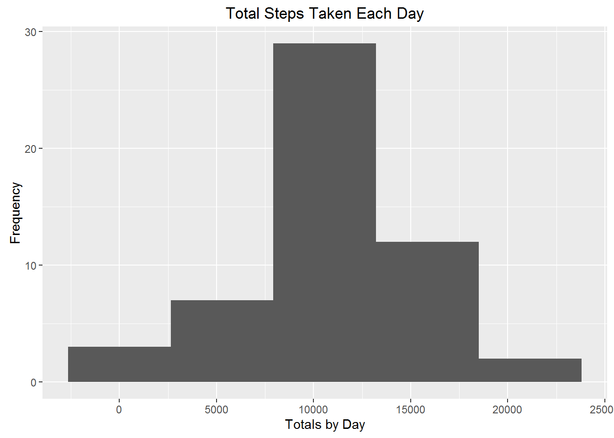
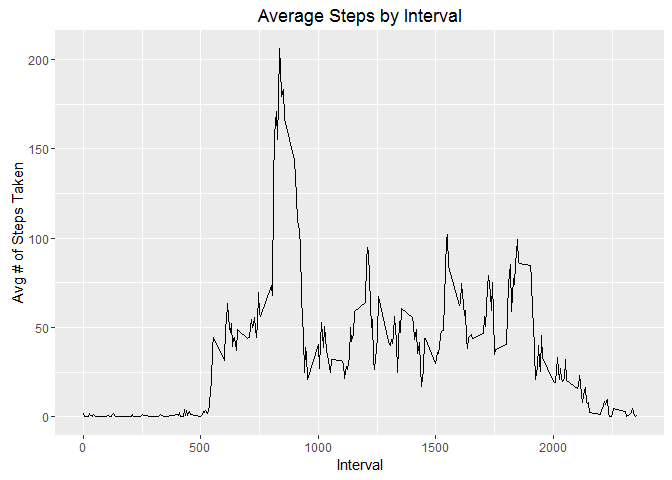
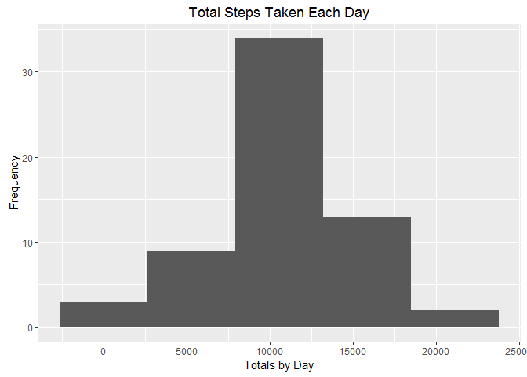
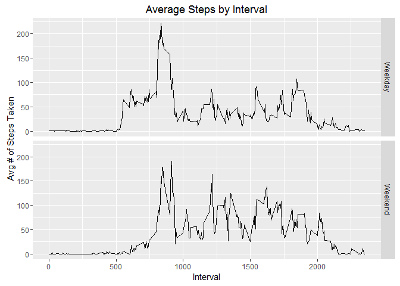

# Reproducible Research Course Project 1
Ian Roberts  
October 23, 2016  


##Loading the Data

To do this assignment, we first need the data. We can get it in a hop, a skip, and a jump.


```r
file = "https://d396qusza40orc.cloudfront.net/repdata%2Fdata%2Factivity.zip"
download.file(file, destfile = "RepData.zip")
unzip("RepData.zip")
activities <- read.csv("activity.csv", na.strings = "NA")
```


##What is mean total number of steps taken per day?

Next portion has to do with the total number of steps taken over the sixty days in the set. 


```r
library(dplyr)
nsum <- na.omit(activities) %>% 
        with(tapply(steps, date, sum))
print(nsum)
```

```
## 2012-10-01 2012-10-02 2012-10-03 2012-10-04 2012-10-05 2012-10-06 
##         NA        126      11352      12116      13294      15420 
## 2012-10-07 2012-10-08 2012-10-09 2012-10-10 2012-10-11 2012-10-12 
##      11015         NA      12811       9900      10304      17382 
## 2012-10-13 2012-10-14 2012-10-15 2012-10-16 2012-10-17 2012-10-18 
##      12426      15098      10139      15084      13452      10056 
## 2012-10-19 2012-10-20 2012-10-21 2012-10-22 2012-10-23 2012-10-24 
##      11829      10395       8821      13460       8918       8355 
## 2012-10-25 2012-10-26 2012-10-27 2012-10-28 2012-10-29 2012-10-30 
##       2492       6778      10119      11458       5018       9819 
## 2012-10-31 2012-11-01 2012-11-02 2012-11-03 2012-11-04 2012-11-05 
##      15414         NA      10600      10571         NA      10439 
## 2012-11-06 2012-11-07 2012-11-08 2012-11-09 2012-11-10 2012-11-11 
##       8334      12883       3219         NA         NA      12608 
## 2012-11-12 2012-11-13 2012-11-14 2012-11-15 2012-11-16 2012-11-17 
##      10765       7336         NA         41       5441      14339 
## 2012-11-18 2012-11-19 2012-11-20 2012-11-21 2012-11-22 2012-11-23 
##      15110       8841       4472      12787      20427      21194 
## 2012-11-24 2012-11-25 2012-11-26 2012-11-27 2012-11-28 2012-11-29 
##      14478      11834      11162      13646      10183       7047 
## 2012-11-30 
##         NA
```

That's strange, there are eight days missing after we removed the NAs. Let's investigate further.


```r
na.omit(activities) %>% with(table(date))
```

```
## date
## 2012-10-01 2012-10-02 2012-10-03 2012-10-04 2012-10-05 2012-10-06 
##          0        288        288        288        288        288 
## 2012-10-07 2012-10-08 2012-10-09 2012-10-10 2012-10-11 2012-10-12 
##        288          0        288        288        288        288 
## 2012-10-13 2012-10-14 2012-10-15 2012-10-16 2012-10-17 2012-10-18 
##        288        288        288        288        288        288 
## 2012-10-19 2012-10-20 2012-10-21 2012-10-22 2012-10-23 2012-10-24 
##        288        288        288        288        288        288 
## 2012-10-25 2012-10-26 2012-10-27 2012-10-28 2012-10-29 2012-10-30 
##        288        288        288        288        288        288 
## 2012-10-31 2012-11-01 2012-11-02 2012-11-03 2012-11-04 2012-11-05 
##        288          0        288        288          0        288 
## 2012-11-06 2012-11-07 2012-11-08 2012-11-09 2012-11-10 2012-11-11 
##        288        288        288          0          0        288 
## 2012-11-12 2012-11-13 2012-11-14 2012-11-15 2012-11-16 2012-11-17 
##        288        288          0        288        288        288 
## 2012-11-18 2012-11-19 2012-11-20 2012-11-21 2012-11-22 2012-11-23 
##        288        288        288        288        288        288 
## 2012-11-24 2012-11-25 2012-11-26 2012-11-27 2012-11-28 2012-11-29 
##        288        288        288        288        288        288 
## 2012-11-30 
##          0
```

Okay, so according to this table, of the 288 values from each of the eight days missing in our sum, all were missing. So our code was correct!

Let's do some further analysis on this sum.

But first, this will be a lot easier if we turn 'nsum' into a data frame. Credit to doug on stackoverflow[1]


```r
nsumd <- na.omit(activities) %>% 
         with(aggregate(steps, list(date), sum))
class(nsumd)
```

```
## [1] "data.frame"
```

```r
dim(nsumd)
```

```
## [1] 53  2
```

As we can see, it came out with a data frame with two columns, and removed the 8 days that are NAs. Much easier to work with!

Onward and upward! Now let's make us a histogram.


```r
library(ggplot2)
ggplot(nsumd, aes(x)) + geom_histogram(bins = 5) + 
        labs(title = "Total Steps Taken Each Day", x = "Totals by Day",
                 y = "Frequency")
```

<!-- -->

Looks like a nice normal distribution.

Now for the mean and the median to confirm


```r
mean(nsumd$x)
```

```
## [1] 10766.19
```

```r
median(nsumd$x)
```

```
## [1] 10765
```

We were right! The mean and median are very close, making this a normal distribution. 

##What is the average daily activity pattern?

Now that we've looked a little bit by day, let's get a finer look at our subject's movement by five minute interval.


```r
nmean <- na.omit(activities) %>% 
        with(aggregate(steps, list(interval), mean)) %>% 
        as.data.frame
        names(nmean) <- c("interval", "mean")
ggplot(nmean, aes(interval, mean)) + geom_line() + 
        labs(title = "Average Steps by Interval", x = "Interval", 
                 y = "Avg # of Steps Taken")
```

<!-- -->

Now to get an exact value on which interval is the busiest


```r
nmean[which.max(nmean$mean),]
```

```
##     interval     mean
## 104      835 206.1698
```

Seeing as how the max value is so much higher than any other value, we could hazard a guess and say our subject goes for a run/walk before they tackle their day

##Imputing missing values

So, we know that there are some missing values, and we know that potentially they could skew our data. Let's find out what we're dealing with.


```r
table(is.na(activities))
```

```
## 
## FALSE  TRUE 
## 50400  2304
```

Looks like there are 2304 missing values. The hunt continues!


```r
table(is.na(activities$interval))
```

```
## 
## FALSE 
## 17568
```

```r
table(is.na(activities$date))
```

```
## 
## FALSE 
## 17568
```

```r
table(is.na(activities$steps))
```

```
## 
## FALSE  TRUE 
## 15264  2304
```

It would seem that 'steps' is our culprit. And from the table in *Number of Steps per Day*, we know that all our missing steps are from those eight days. 

To get a good idea as to what those values would be, we're going to impute the data. Our method here will be to take the average of the closest three days and use those as our new values.


```r
ad <- activities$date
nav <- activities[is.na(activities$steps),]
with(nav, date <- as.Date(date))
activitiesImputed <- activities

d1 <- activities[ad == "2012-10-02" | ad == "2012-10-03" | ad == "2012-10-04",] %>% 
        with(aggregate(steps, list(interval), mean))
                activitiesImputed$steps[activitiesImputed$date==unique(nav$date)[1]] <- d1$x

d2 <- activities[ad == "2012-10-05" | ad == "2012-10-06" | ad == "2012-10-07",] %>% 
        with(aggregate(steps, list(interval), mean))
                activitiesImputed$steps[activitiesImputed$date==unique(nav$date)[2]] <- d2$x

d3 <- activities[ad == "2012-10-31" | ad == "2012-11-02" | ad == "2012-11-03",] %>% 
        with(aggregate(steps, list(interval), mean))
                activitiesImputed$steps[activitiesImputed$date==unique(nav$date)[3]] <- d3$x

d4 <- activities[ad == "2012-11-05" | ad == "2012-12-06" | ad == "2012-11-07",] %>% 
        with(aggregate(steps, list(interval), mean))
                activitiesImputed$steps[activitiesImputed$date==unique(nav$date)[4]] <- d4$x

d5 <- activities[ad == "2012-11-06" | ad == "2012-11-07" | ad == "2012-11-08",] %>% 
        with(aggregate(steps, list(interval), mean))
                activitiesImputed$steps[activitiesImputed$date==unique(nav$date)[5]] <- d5$x

d6 <- activities[ad == "2012-11-11" | ad == "2012-11-12" | ad == "2012-11-13",] %>% 
        with(aggregate(steps, list(interval), mean))
                activitiesImputed$steps[activitiesImputed$date==unique(nav$date)[6]] <- d6$x

d7 <- activities[ad == "2012-11-15" | ad == "2012-11-16" | ad == "2012-11-17",] %>%
        with(aggregate(steps, list(interval), mean))
                activitiesImputed$steps[activitiesImputed$date==unique(nav$date)[7]] <- d7$x

d8 <- activities[ad == "2012-11-27" | ad == "2012-11-28" | ad == "2012-11-29",] %>% 
        with(aggregate(steps, list(interval), mean))
                activitiesImputed$steps[activitiesImputed$date==unique(nav$date)[8]] <- d8$x

table(is.na(activities$steps))
```

```
## 
## FALSE  TRUE 
## 15264  2304
```

```r
table(is.na(activities$steps))
```

```
## 
## FALSE  TRUE 
## 15264  2304
```

```r
table(is.na(activitiesImputed$steps))
```

```
## 
## FALSE 
## 17568
```

Success! Now let's recreate the analyses from Heading 2 and see if there's any difference.


```r
isum <- with(activitiesImputed, aggregate(steps, list(date), sum))

ggplot(isum, aes(x)) + geom_histogram(bins = 5) + 
        labs(title = "Total Steps Taken Each Day", x = "Totals by Day",
                 y = "Frequency")
```

<!-- -->

```r
mean(isum$x)
```

```
## [1] 10669.71
```

```r
median(isum$x)
```

```
## [1] 10600
```

These do look slightly different, and there is more variation in the mean and median, but we are still firmly planted in normality.

##Are there differences in activity patterns between weekdays and weekends?

Final question! Lets dig deep.

First, let's make a column containing 'weekday' and 'weekend'. For the purposes of this project, Friday will be counted as a weekday, because our subject presumably still goes to work and will have the same habits


```r
activitiesImputed$date <- as.Date(activitiesImputed$date)
activitiesImputed$days <- weekdays(activitiesImputed$date)
ad <- activitiesImputed$days
ad[ad=="Monday" | ad=="Tuesday" | ad=="Wednesday" | ad=="Thursday" | ad=="Friday"] <- "Weekday"
ad[ad=="Saturday" | ad=="Sunday"] <- "Weekend"
ad <- as.factor(ad)
activitiesImputed$days <- ad
head(activitiesImputed$days)
```

```
## [1] Weekday Weekday Weekday Weekday Weekday Weekday
## Levels: Weekday Weekend
```

Now for a time series plot across day types.

```r
wkdy <- filter(activitiesImputed, days == "Weekday") %>%
        with(aggregate(steps, list(interval), mean)) %>% 
        as.data.frame
        wkdy$days <- "Weekday"
        names(wkdy) <- c("interval", "mean", "days")
wknd <- filter(activitiesImputed, days == "Weekend") %>%
        with(aggregate(steps, list(interval), mean)) %>% 
        as.data.frame
        wknd$days <- "Weekend"
        names(wknd) <- c("interval", "mean", "days")
full <- full_join(wkdy,wknd)
```

```
## Joining, by = c("interval", "mean", "days")
```

```r
ggplot(full, aes(interval, mean)) + geom_line() + facet_grid(days~.)+ 
        labs(title = "Average Steps by Interval", x = "Interval", y=
                     "Avg # of Steps Taken")
```

<!-- -->

Judging by our two graphs, it looks like our subject has a desk job. However, they are much more active on the weekend.
